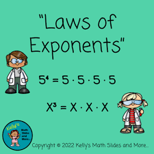
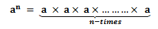

# Exponent Rules
##  What are Exponents?
Exponents are used to show repeated multiplication of a number by itself. For example, $7 * 7 * 7$ can be represented as $7^3$.

Here are some other examples:
* $3^4 = 3 * 3 * 3$
* $10^5 = 10*10*10*10*10$
* $16^2 = 16*16$

Suppose, a number ‘a’ is multiplied by itself n-times, then it is represented as an where a is the base and n is the exponent.

Exponents follow certain rules that help in simplifying expressions which are also called its laws. Let us discuss the laws of exponents in detail.
## Rules of Exponents With Examples
As discussed earlier, there are different  laws or rules defined for exponents. The important laws of exponents are given below:
* $a^m *a^n=a^{m+n}$
* $\frac{a^m}{a^n}=a^{m-n}$
* $(a^m)^n=a^{mn}$
* $\frac{a^n}{b^n}=(\frac{a}{b})^n$
* $a^0=1$
* $a^{-m}=(\frac{1}{a})^m$
* $a^\frac{1}{n}=\sqrt[n]{a}$

| Key words | Defintions |
| --- | --- |
| Exponents | a number or letter written above and to the right of a mathematical expression called the base. |
| Variable | a quantity that may be changed according to the mathematical problem |
