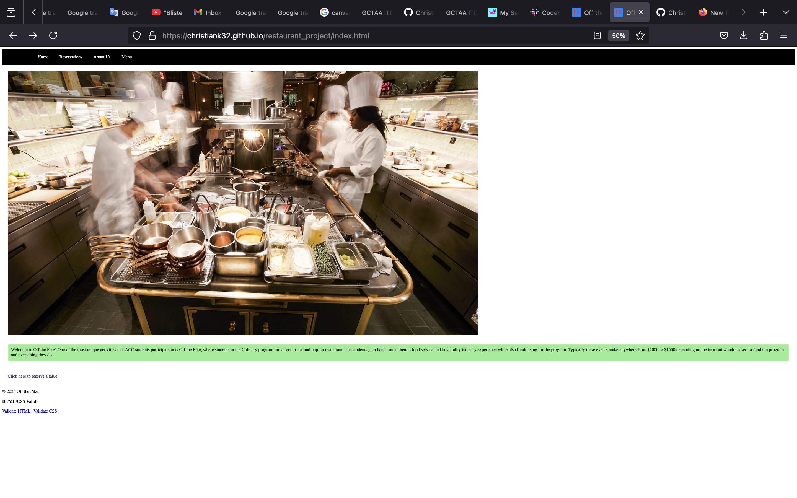
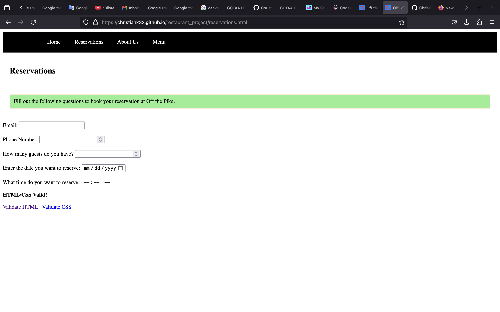

### Off the Pike project

- [click here to view my project](https://christiank32.github.io/restaurant_project/)

- [click here to view the repo](https://github.com/ChristianK32/restaurant_project)

## Screenshots of my two pages

# Reflection

- The form is to acquire all the information needed to book a reservation. The form uses a post method and consists of email inputs, number inputs, date inputs, and time inputs. 

- The pull request went well and the merging went well.
